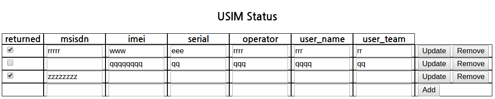

News
====

- Both the pure orbit page and lua programming approach implemented     2015.5.5

About
=====
This is just a personnal study of orbit

Testing environment

- Ubuntu 12.04

Prerequisite

- server side
::
 sudo apt-get install lua (lua 5.1)
 sudo luarocks install orbit

Minor install trouble shooting needed. Orbit is not that kind to novice!
If anyone want this let me know.. though I cannot promise any..

- client side
::
 chrome, IE or what ever browser you prefer

References
==========

This project has been started from the example of Orbit, 'todo' :
https://github.com/keplerproject/orbit/tree/master/samples/todo

Journeyer J. Joh

